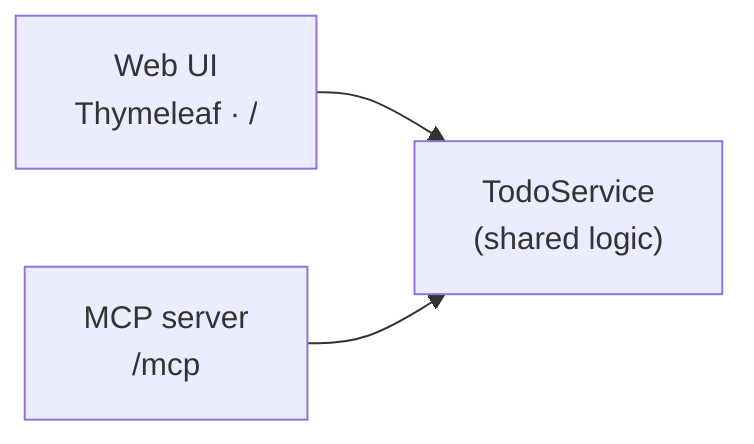

# Spring Boot Todo — Web UI to MCP

A small Spring Boot 4.1 / Java 25 Todo app that starts as a web app and exposes
the same data to MCP clients such as GitHub Copilot:

- a **Thymeleaf web UI** (`GET /`),
- and **MCP tools** (`POST /mcp`) that GitHub Copilot can call.

Both delegate to one `TodoService`.



**Stack:** Java 25 · Spring Boot 4.1.0 · Spring AI 2.0.0 · Thymeleaf · Maven

> [!IMPORTANT]
> This repository is a local development and demonstration sample, not a
> production deployment. Todos are stored in memory, the MCP mutation tools
> are unauthenticated, and Actuator returns detailed health information. Do not
> expose port 8080 to untrusted networks. Before deploying, add authentication,
> authorization, persistent storage, and production-appropriate Actuator settings.

---

## Prerequisites

- JDK 25 (`java -version` should report version 25)
- VS Code with the **Extension Pack for Java** and **Spring Boot Extension Pack**
- GitHub Copilot access for the Copilot and MCP workflow

Maven does not need to be installed separately; the repository includes the
Maven Wrapper.

## Run it

**Windows (PowerShell):**

```powershell
.\mvnw.cmd spring-boot:run
```

**macOS or Linux:**

```bash
./mvnw spring-boot:run
```

- Web UI: http://localhost:8080
- Health: http://localhost:8080/actuator/health

## Step 1 — The web app

The web app has four controller methods: show, add, toggle, and delete. See
[TodoController.java](src/main/java/com/example/tododemo/web/TodoController.java)
and [index.html](src/main/resources/templates/index.html).

## Step 2 — Add MCP

Each method in `TodoTools` is annotated with `@McpTool` and delegates to `TodoService`:

```java
@McpTool(name = "add_todo", description = "Create a new todo item with the given title.")
public Todo addTodo(@McpToolParam(description = "The title of the new todo", required = true) String title) {
    return service.add(title);
}
```

Five tools are exposed: `list_todos`, `get_todo`, `add_todo`, `complete_todo`, `delete_todo`.

**One critical setting** in [application.properties](src/main/resources/application.properties):

```properties
spring.ai.mcp.server.protocol=STREAMABLE
```

> The WebMVC MCP starter defaults to the older SSE transport. Without
> `protocol=STREAMABLE`, `POST /mcp` returns **404**. On startup the log confirms:
> `Registered tools: 5`.

### Connect VS Code

[.vscode/mcp.json](.vscode/mcp.json) points VS Code at the server:

```json
{ "servers": { "todo-mcp": { "type": "http", "url": "http://localhost:8080/mcp" } } }
```

Start the app first, then **Start** the server via the code-lens in `.vscode/mcp.json`.
In the Chat view (Agent mode), enable the `todo-mcp` tools and ask, e.g.:
*"Use the todo-mcp tools to add a todo called 'Email the stakeholders', then list all todos."*

The **Start** action connects VS Code to the already-running HTTP endpoint; it
does not launch the Spring Boot application.

---

## Test

Run the Java tests with the Maven Wrapper.

**Windows (PowerShell):**

```powershell
.\mvnw.cmd test
```

**macOS or Linux:**

```bash
./mvnw test
```

The UI exposes stable `data-testid` hooks (`new-todo-input`, `add-todo`, `todo-item`,
`delete-todo`) so a Playwright run can drive add → complete → delete end to end.

Install the Playwright MCP server directly in VS Code:

1. Select the **Extensions** button in the VS Code Activity Bar.
2. Search for `@mcp playwright`.
3. Select the Playwright MCP server and choose **Install**.
4. Review and trust the server when prompted, then confirm its tools appear in
    the Chat tools picker.

The **Install** action adds the server to your VS Code user profile, making it
available across workspaces. It does not add Playwright to this repository's
[.vscode/mcp.json](.vscode/mcp.json). The separate **Install in Workspace**
action is what writes a server configuration to the workspace file.

With the app running, ask Copilot Chat in Agent mode:

> Use the Playwright tools to open http://localhost:8080. Add a todo called
> "Verify the browser flow", find that todo's row, complete it and verify it is
> checked, then delete it and verify it is gone.

Review the Playwright tool calls and final verification in Copilot Chat.

---

## Optional next step — GitHub Copilot coding agent

The Todo page intentionally uses the browser's default styling. A prepared task,
[docs/copilot-agent-issue.md](docs/copilot-agent-issue.md), asks the coding agent to
install the supplied [stylesheet](docs/styles.css) without changing its contents
or the app's behavior. This
requires a GitHub account with Copilot coding agent enabled and write access to
the repository or a fork. For this sample, fork the repository and clone the fork
so it is the `origin` remote. Run **Chat: Open Agents Window** from the Command
Palette, select **New**, and use the workspace dropdown to choose the writable
fork as a GitHub repository instead of the local folder or the `microsoft`
upstream. Selecting a repository there automatically uses Copilot cloud agent.
The regular Chat view does not expose this repository picker. If the target
repository belongs to an organization that enforces SAML SSO, authorize VS Code's
GitHub OAuth app for that organization first. Then review and test the draft pull
request before deciding whether to merge it.

---

## Demo recording script

[scripts/script.md](scripts/script.md) is a four-episode walkthrough that uses this project
to demo **Java** development in **VS Code** with **GitHub Copilot**:

1. Build and debug a Spring Boot app (Extension Pack for Java, Spring Initializr, breakpoints, live memory view).
2. Expose the endpoints to Copilot as **MCP** tools.
3. Let Copilot test the UI end to end with **Playwright**.
4. Ask the **GitHub Copilot coding agent** to polish the UI, then review and validate the draft PR it opens.

---

## Contributing and support

- Read [CONTRIBUTING.md](CONTRIBUTING.md) before submitting a pull request.
- Use [SUPPORT.md](SUPPORT.md) for help and issue-reporting guidance.
- Report vulnerabilities according to [SECURITY.md](SECURITY.md), not through a public issue.
- Participation is governed by the [Microsoft Open Source Code of Conduct](CODE_OF_CONDUCT.md).

## License

MIT License. See [LICENSE](LICENSE) for details.