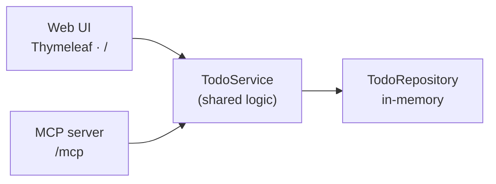

# Java, Spring Boot, and GitHub Copilot in Visual Studio Code

A four-chapter series that takes one small Spring Boot application from a cloned folder to
an app GitHub Copilot can call and test — without leaving the editor.

Each chapter stands on its own. Start wherever you need to.

| # | Chapter | You will end up with |
|---|---------|----------------------|
| 1 | [Build and Run Your First Spring Boot App](1-build-and-run.md) | The tooling installed, the project understood, and a web app running on port 8080. |
| 2 | [Debug and Inspect a Spring Boot Request](2-debug-and-inspect.md) | A paused request, a value you stepped to, and a health and memory check on the live process. |
| 3 | [Expose Your Java Operations to Copilot with MCP](3-expose-tools-with-mcp.md) | Five Java methods published as Model Context Protocol tools, called from Copilot Chat. |
| 4 | [Let Copilot Test Your App with Playwright](4-test-with-playwright.md) | A browser journey Copilot runs and asserts against your running app. |

## The sample

Every chapter uses the same application: a Todo list with a Thymeleaf web UI and an MCP
tool surface, both delegating to one `TodoService`.

**Stack:** Java 25 · Spring Boot · Spring AI · Thymeleaf · Maven

Clone it from [microsoft/github-copilot-java-mcp-demo](https://github.com/microsoft/github-copilot-java-mcp-demo)
and open the folder in Visual Studio Code.

> [!IMPORTANT]
> This repository is a local development and demonstration sample, not a production
> deployment. Todos are stored in memory, the MCP mutation tools are unauthenticated, and
> Actuator returns detailed health information. Do not expose port 8080 to untrusted
> networks.

## Conventions used in these chapters

- Every action has a visible button, menu, or link. Keyboard input is only needed for entering text.
- Text shown in a code font, whether inline or in a fenced block, is meant to be copied rather than retyped.
- Each chapter starts from a stopped app with port 8080 free, and ends by shutting the app down again.
