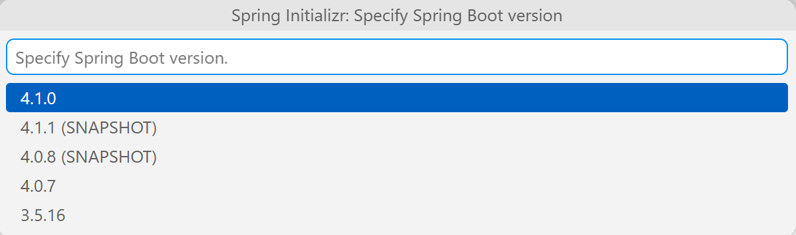
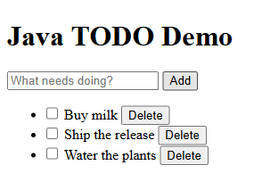
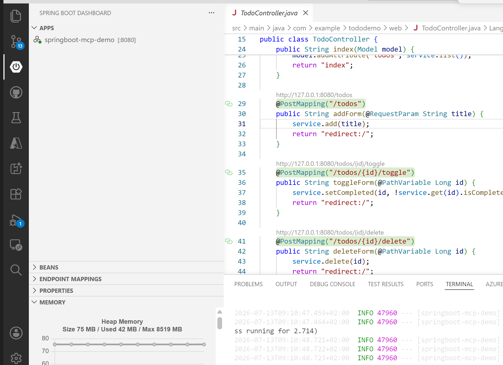
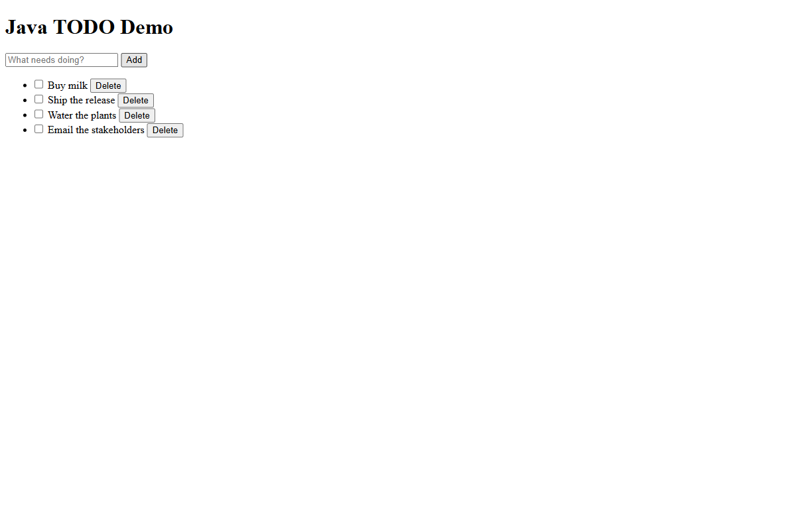
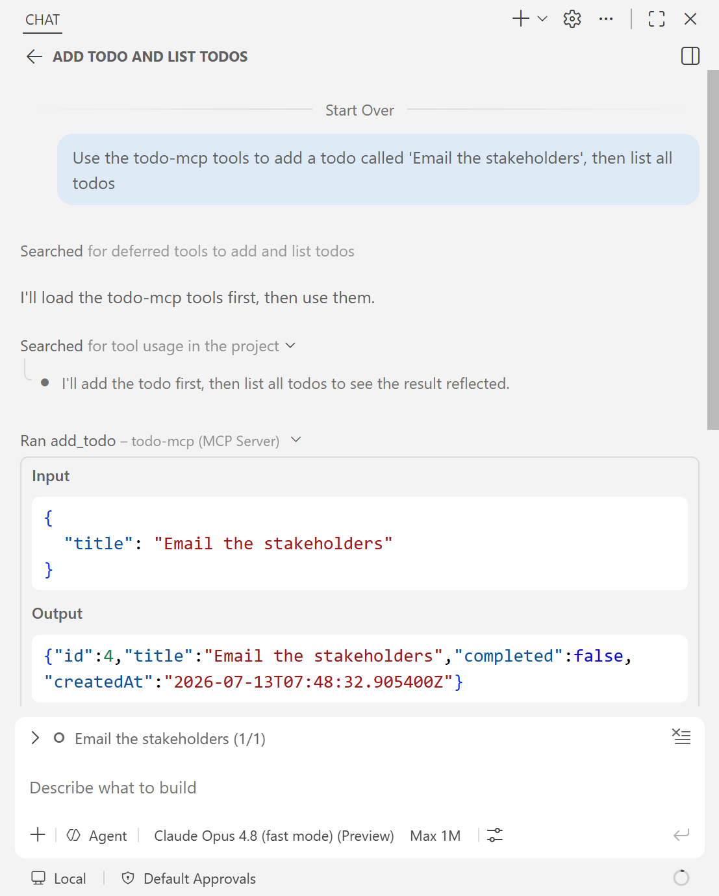
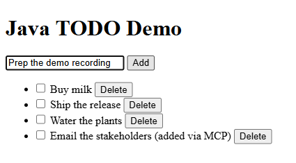

# Demo Recording Script — Java Spring Boot + Model Context Protocol (MCP) + Copilot

**Demo source:** [microsoft/github-copilot-java-mcp-demo](https://github.com/microsoft/github-copilot-java-mcp-demo)

> **Publication check:** Review every screenshot and screen recording for repository names, local paths, account names, notifications, and other identifying information. Redact or replace any exposed details before publishing.

> **Recording rule:** Treat each `Say` cell as a sequence of timed cues, not as one paragraph to read before the row. Say a sentence immediately before its matching action, perform that action, and then continue with the next sentence. The final sentence in each row should connect the result on screen to the next row. Stay silent only where the `Do` column explicitly says to wait without narration.

## Episode 1 of 4 — Build and debug your first Spring Boot app

### Intro — Talking head (~50s)

> Welcome to this introduction to Java and Spring Boot in Visual Studio Code.
>
> Java is one of the world’s most widely used programming languages. Organizations of every size use it for enterprise applications, financial systems, cloud services, and Android apps. Its reliability, performance, and large ecosystem have made it a popular choice for decades.
>
> Spring Boot is one of the most popular Java frameworks. It handles much of the setup and configuration needed for modern applications, so developers can focus on application code instead of boilerplate.
>
> Whether you’re new to Java or already have some experience, the goal is to get you up and running with Java development in Visual Studio Code. I’ll set up the Java and Spring tooling and use Spring Initializr to retrace how the starter project was configured. Then I’ll explore and run the finished sample, follow a request through the code with the debugger, and monitor the app’s health and memory. Let’s jump right in.

**Do:** End on “let's jump right in,” then cut to screen share.

### Demo — Set up, build & run

**Before recording:** Have Java 25, the Extension Pack for Java, and the Spring Boot Extension Pack installed. Open the completed sample in VS Code, make sure the Maven Explorer and Spring Boot Dashboard views are available, and prepare a browser tab for http://localhost:8080. During the take, show each extension pack's **Installed** state; do not reinstall or update extensions.

**Pacing:** Leave Java import, the Maven build, and application startup silent after announcing each wait.

| Where | Do | Say |
|-------|----|-----|
| VS Code — Extensions view (`Ctrl+Shift+X`) | Search **"Extension Pack for Java"**, open its result, and pause on its **Installed** state. | "I'll begin in the Extensions view by searching for the Extension Pack for Java. It is already installed in this setup, giving VS Code Java language support, debugging, Maven, and testing. With the editor tooling confirmed, I'll check where VS Code manages the JDK it runs on." |
| Command Palette (`Ctrl+Shift+P`) | Run **"Java: Install New JDK"**, briefly show the installation options, then press `Esc` without installing another JDK. | "The extension pack still needs a JDK, so I'll run Java: Install New JDK from the Command Palette. This machine already has Java 25, so I'll only show the available installation options and cancel without installing another copy. With the JDK covered, I can check the Spring-specific tooling." |
| VS Code — Extensions view | Search **"Spring Boot Extension Pack"**, open its result, and pause on its **Installed** state. | "Back in Extensions, I'll search for the Spring Boot Extension Pack. It is also already installed, adding Spring Initializr, the Spring Boot Dashboard, and Spring configuration support. Those tools are enough to retrace how this sample was created." |
| Command Palette (`Ctrl+Shift+P`) | Run **"Spring Initializr: Create a Maven Project"** and pause at the Spring Boot version picker. | "Now I'll run Spring Initializr: Create a Maven Project from the Command Palette. The first picker asks for the Spring Boot version, so this is where the project definition begins." |
| Spring Initializr prompts | Choose Spring Boot 4.1.0 → Java → group `com.example` → artifact `springboot-mcp-demo` → **Jar** → Java 25. | "I'll select Spring Boot 4.1.0 to match the sample, and choose Java as the language. For the project coordinates, I'll enter `com.example` as the group and `springboot-mcp-demo` as the artifact. I'll package it as a Jar and target Java 25. With the project identity set, the next picker defines what the application can do." |
| Dependency picker | Add **Spring Web**, **Thymeleaf**, **Actuator**, and **Model Context Protocol Server**. Pause with all four selected, then press `Esc` to cancel the wizard before it generates a project. | "I'll add Spring Web for HTTP handling and Thymeleaf for the server-rendered page. Actuator adds runtime health information, and Model Context Protocol Server adds the MCP support used later in the series. These four selections match the completed sample. Because that sample is already open, I'll pause on the final list and cancel before Initializr generates a duplicate project." |
| Explorer | Expand the `com.example.tododemo` package and `templates` folder in the completed sample already open in the workspace. | "The wizard is closed, so I'm back in the completed sample from the repository linked in the description. I'll expand its Todo package and templates folder to show the Java layers and the web page that were added to the generated starter. I'll start at the class that launches all of them." |
| `SpringbootMcpDemoApplication.java` | Show `@SpringBootApplication` and `main`. | "This `@SpringBootApplication` annotation marks the application entry point. The `main` method starts Spring Boot, which scans this package, creates the application components, and wires their dependencies. From here, I'll follow that structure from the data model into the shared application logic." |
| `Todo.java` → `TodoRepository.java` → `TodoService.java` | Show the `Todo` fields, the repository's `@Repository` and in-memory map, then the service's `@Service` and constructor. | "First, `Todo` defines the id, title, completion state, and creation time. Next, `TodoRepository` is a Spring repository that keeps those objects in an in-memory map. Finally, `TodoService` receives that repository through its constructor and provides the operations used by the rest of the app. With the shared operations in place, I can trace how the web page calls one of them." |
| `templates/index.html` → `TodoController.java` | In the template, show the add form's `POST /todos` action and `title` input. Then open the controller and show the matching `@PostMapping`, `service.add(title)`, and redirect. | "In the Thymeleaf template, the add form posts the `title` field to `/todos`. I'll open `TodoController` and find the matching `@PostMapping`, where the controller passes that title to `service.add` and redirects to the home page. The browser, controller, and service now form one complete request path, so I'll build and test it." |
| Maven Explorer | Expand **springboot-mcp-demo → Lifecycle**, run **package**, and wait for **`BUILD SUCCESS`** in the Maven output. **Do not narrate while Maven builds and runs the tests.** | "I'll open Maven Explorer, expand the project's Lifecycle goals, and run `package`. Maven will compile the code, run the tests, and create the application Jar. I'll stay silent while it works and continue when the output shows `BUILD SUCCESS`." |
| Spring Boot Dashboard | Find **springboot-mcp-demo**, select its **Run** action, and wait for the app to show as running. **Do not narrate while it starts.** | "The successful build confirms the code and tests pass. Now I'll find the same project in the Spring Boot Dashboard and select Run. I'll let startup finish silently, then use the Dashboard's running state to open the application." |
| Spring Boot Dashboard → browser | Point to the app's running state and port in the Dashboard, then open http://localhost:8080. | "The Dashboard now shows the application running on port 8080. I'll open that address in the browser so I can exercise the request path I just traced." |
| Browser | Add a todo called **Prepare the demo**, mark that item complete, and delete it. | "I'll enter `Prepare the demo` and submit the form to create a Todo. When the new row appears, I'll select its checkbox to mark it complete. Then I'll delete that same row. All three changes return through the controller and render immediately, so the basic flow is working." |
| Spring Boot Dashboard | Return to the Dashboard and use the app's **Stop** action. | "The add, complete, and delete cycle worked. I'll return to the Dashboard and stop this run, which frees port 8080 so I can launch the same application with the debugger attached." |

**The Spring Initializr version picker:**

**The running Todo web app:**

### Demo — Debug & watch memory

**Before recording:** Close Copilot Chat and hide any terminal or output content that exposes local paths, account details, or unrelated notifications.

| Where | Do | Say |
|-------|----|-----|
| Editor — `TodoController.java` | Click the gutter to set a breakpoint on the `service.add(title)` line in `addForm`. | "I'll return to `TodoController` and set a breakpoint on the line that passes the submitted title to the service. The next add request will pause at the boundary between the web layer and the application logic. Now I need to restart the app under the debugger." |
| Spring Boot Dashboard | Select the app's **Debug** action and wait for the debugger to connect. **Do not narrate while the app starts.** | "In the Spring Boot Dashboard, I'll select Debug for the same application. The normal run is stopped, so the debug process can use port 8080. I'll wait silently for the debugger to connect before inspecting its live controls." |
| Spring Boot Dashboard → `TodoController.java` | Show the app's running debug state. Expand the app and point out **Beans**, **Endpoint Mappings**, **Properties**, and **Memory**. Then return to the controller and show the gray URL hints above its mappings. | "The Dashboard now shows the app running with the debugger attached. I'll expand it to reveal live views for its beans, endpoint mappings, properties, and memory. Back in the controller, Spring Tools also adds gray URL hints above the mapped methods. I'll use the root hint to send a request to the breakpoint." |
| Editor → browser | Click the root URL hint, enter **Trace this request** in the form, and submit it. Wait for VS Code to stop at the breakpoint. | "I'll open the root page directly from the controller's URL hint. In the form, I'll enter `Trace this request` and submit it. That request should stop in VS Code before the controller calls the service." |
| Debug toolbar + Variables panel | Expand **Local** and inspect `title`. Step into `TodoService.add` (`F11`), step over the `Todo todo = ...` line (`F10`), and inspect the new `todo` local. | "The breakpoint has paused on the service call. In the Local variables, I'll expand `title` and confirm that the controller received `Trace this request`. Next, I'll press F11 to step into `TodoService.add`. I'll use F10 to execute the line that creates the `Todo`, then inspect the new local object before the repository assigns its id." |
| Debug toolbar → browser | Continue (`F5`), wait for the request to finish, and show **Trace this request** in the browser. Leave the debug session running. | "The service has created the object, so I'll press F5 to continue. The repository can now assign the id, the controller can redirect, and Thymeleaf can render the refreshed list. When `Trace this request` appears in the browser, the end-to-end request is complete. I'll keep the debugger attached for two runtime checks." |
| Browser | Open http://localhost:8080/actuator/health and point to the `UP` status. | "First, I'll open the Actuator health endpoint. Its `UP` status confirms that the running application is healthy at this moment. For a live signal rather than a single response, I'll return to the Dashboard's Memory view." |
| Spring Boot Dashboard → running app → **Memory** view | Open **Memory** and show the live heap information updating. | "I'll expand the running app and open Memory. This view updates the application's heap information while the debug process continues to run. That completes the runtime inspection, so I can shut the process down cleanly." |
| Debug toolbar | Stop the debug session (`Shift+F5`) and confirm the app is no longer running. | "I'll stop the debug session with Shift+F5. The Dashboard no longer shows the app as running, and port 8080 is free for the next episode." |

**Actuator health summary (all systems UP; local filesystem details removed):**

**Spring Boot Dashboard Memory view:**

### Outro — Talking head (~20s)

> And there it is. I set up the Java and Spring extensions and used Spring Initializr to retrace the starter configuration. Then I explored and ran the finished sample, followed a request through the code with the debugger, and monitored the app’s health and memory. That took me from a new Java setup to understanding what a Spring Boot app is doing while it runs. What would you build first with Java and Spring Boot? Let me know in the comments. Thanks for watching, and happy building.

---

## Episode 2 of 4 — Expose your endpoints to Copilot with the Model Context Protocol (MCP)

### Intro — Talking head (~20s)

> In this video, I'll show how a Spring Boot app becomes a set of tools GitHub Copilot can call directly in Visual Studio Code. I'll use Spring AI to expose the existing Java operations through the Model Context Protocol, or MCP, while keeping the web interface and Copilot connected to the same service. Let's jump right in.

**Do:** End on “let's jump right in,” then cut to screen share.

**Prerequisites:** Clone the finished sample from the [GitHub repository](https://github.com/microsoft/github-copilot-java-mcp-demo) and open it in VS Code with GitHub Copilot installed and signed in. Allow MCP tool use when VS Code prompts for trust or confirmation.

**Before recording:** Stop the Spring Boot app and the `todo-mcp` connection, make sure port 8080 is free, and prepare a browser tab at http://localhost:8080. Trust the repository and workspace before the take so only the MCP connection and tool confirmations described below can appear.

### Demo

| Where | Do | Say |
|-------|----|-----|
| `pom.xml` | Show the `spring-ai-starter-mcp-server-webmvc` dependency. Then show the `spring-ai-bom` import and the `spring-ai.version` value `2.0.0`. | "I've cloned the finished Todo sample from the repository linked in the description and opened it in VS Code with GitHub Copilot signed in. The application already has Todo operations; this episode exposes them as MCP tools. In `pom.xml`, I'll first show Spring AI's WebMVC MCP server starter. Then I'll move to the imported Spring AI Bill of Materials and its `2.0.0` version property. The starter supplies the MCP server support, while the BOM keeps its Spring AI dependencies on the same version. With that support on the classpath, I can show the Java methods it publishes." |
| `mcp/TodoTools.java` | Show the class's `@Component`, the five `@McpTool` methods, an `@McpToolParam`, and each method's delegation to `TodoService`. | "`TodoTools` is a Spring component, so the MCP annotation scanner can discover it. I'll move through the five `@McpTool` methods named `list_todos`, `get_todo`, `add_todo`, `complete_todo`, and `delete_todo`. Each annotation gives Copilot a tool name and description, and `@McpToolParam` describes required inputs such as a title or id. The method bodies do not duplicate the application logic; they delegate to the same `TodoService` used by the web page. Now those tools need an HTTP transport that VS Code can connect to." |
| `application.properties` | Highlight `spring.ai.mcp.server.protocol=STREAMABLE`, then point to the server name, version, and instructions. | "In `application.properties`, I'll highlight `spring.ai.mcp.server.protocol=STREAMABLE`. That setting publishes the modern Streamable HTTP endpoint at `/mcp`; without it, this starter uses its older Server-Sent Events transport and a POST to `/mcp` is unavailable. The following properties give the MCP server its name, version, and tool-set instructions. The dependency, tools, and transport are now configured, so I'll start the Java application." |
| Spring Boot Dashboard | Find **springboot-mcp-demo**, select **Run**, and wait for startup without narration. In the app output, show **`Registered tools: 5`**. Leave the app running. | "I'll find `springboot-mcp-demo` in the Spring Boot Dashboard and select Run. I'll stay silent during startup, then look in the application output for `Registered tools: 5`. That message confirms Spring discovered every annotated method. The Java server is ready; the next step is to give VS Code its endpoint." |
| `.vscode/mcp.json` | Show the `todo-mcp` server's `type` and `url`. Select its **Start** code-lens and wait until VS Code shows the connection as running and its tools as discovered. | "This workspace's `.vscode/mcp.json` defines a server named `todo-mcp`. I'll point out its HTTP type and the URL `http://localhost:8080/mcp`, which targets the application already running in the Dashboard. Now I'll select Start and wait for VS Code to connect and discover the five tools. This Start action connects an MCP client; it does not launch the Java process. With the connection running, I can make those tools available in Chat." |
| Copilot Chat — Agent mode | Open the Chat tools picker, find `todo-mcp`, enable its five tools, and close the picker. | "I'll open Copilot Chat in Agent mode and open the tools picker. Under `todo-mcp`, I can see the same five tool names that Spring registered. I'll enable them and close the picker. Copilot can now choose those application operations, so I'll give it a task that requires two of them in sequence." |
| Copilot Chat — Agent mode | Enter *"Use the todo-mcp tools to add a todo called 'Email the stakeholders', then list all todos."* and submit it. When the `add_todo` and `list_todos` confirmations appear, review each tool name and arguments, then choose **Allow**. Wait for the final response. | "I'll ask Copilot to use `todo-mcp` to add a Todo called `Email the stakeholders`, then list all Todos. When the first confirmation appears, I'll verify that Copilot selected `add_todo` with the exact title and choose Allow. For the second call, I'll verify `list_todos` and allow that as well. The final response should contain the newly created item, but I also want to verify it through the application's other interface." |
| Copilot Chat → browser | In Chat, point to **Email the stakeholders** in the structured `list_todos` result. Then refresh the prepared http://localhost:8080 tab and point to the same title in the Todo list. | "The structured tool result contains `Email the stakeholders`, confirming what the MCP call returned. I'll switch to the prepared browser tab and refresh the web page. The same title appears there because the MCP tools and the Thymeleaf controller both delegate to one service and one in-memory repository. That shared result completes the test, so I'll clean up both running connections." |
| Spring Boot Dashboard → `.vscode/mcp.json` | Stop **springboot-mcp-demo** from the Dashboard and confirm it is no longer running. Then select **Stop** for `todo-mcp` in `.vscode/mcp.json`. | "I'll return to the Spring Boot Dashboard and stop the Java application. Because its repository is in memory, stopping the process clears the Todo created during this demo. Then I'll return to `.vscode/mcp.json` and stop the `todo-mcp` client connection. Both sides are now closed and port 8080 is free." |

**Proof it works — a todo created *through MCP* appears in the web interface** (last row):

**Copilot Chat calling the `todo-mcp` tools — the `add_todo` call and its structured result:**

### Outro — Talking head (~20s)

> And there it is. I used Spring AI to expose the Todo operations as tools through the Model Context Protocol, connected those tools to GitHub Copilot in Visual Studio Code, and kept the web interface and Copilot using the same Java service. A Todo created through Copilot now appears in the web app straight away. What part of your own Java application would you turn into a Copilot tool? Let me know in the comments. Thanks for watching, and happy building.

---

## Episode 3 of 4 — Let Copilot test it with Playwright

### Intro — Talking head (~20s)

> In this video, I'll show how to test a Spring Boot web app in Visual Studio Code with GitHub Copilot and Playwright through the Model Context Protocol, or MCP. Passing unit tests don't prove the user interface works for a real user, so I'll have Copilot drive the app in a real browser and verify the experience end to end. Let's jump right in.

**Do:** End on “let's jump right in,” then cut to screen share.

**Prerequisites:** Clone the finished sample from the [GitHub repository](https://github.com/microsoft/github-copilot-java-mcp-demo) and open it in a current version of VS Code with GitHub Copilot installed and signed in. Install the Spring Boot Extension Pack, and allow MCP server installation and tool use when prompted.

**Before recording:** Use a VS Code profile where the Playwright MCP server is not yet installed so the **Install** action is guaranteed to appear. Stop the Spring Boot app, free port 8080, close any browser left from an earlier Playwright run, and open the Spring Boot Dashboard.

### Demo

| Where | Do | Say |
|-------|----|-----|
| VS Code — Extensions view (`Ctrl+Shift+X`) | Search **`@mcp playwright`** and open the Playwright MCP server result. Review its publisher and command configuration. Select **Install**, confirm trust for the server, and wait for its running status. Open the Chat tools picker and show the discovered Playwright tools, but do not enable them yet. | "I've cloned the finished Todo sample from the repository linked in the description and opened it in VS Code with GitHub Copilot signed in. To test the page through a real browser, Copilot needs browser-control tools, so I'll search the MCP server gallery for `@mcp playwright` and open the Playwright result. Before installing it, I'll review the publisher and the command VS Code will run. I'll select Install, confirm that I trust this server, and wait for its status to show that it is running. Finally, I'll open the Chat tools picker and verify that the Playwright tools were discovered. The browser tools are available; before enabling them, I'll show the page elements they will target." |
| `templates/index.html` | Show `data-testid="new-todo-input"`, `data-testid="add-todo"`, `data-testid="todo-item"`, and `data-testid="delete-todo"` in the template. | "In `index.html`, the text input has the stable hook `new-todo-input`, and the submit button has `add-todo`. Each rendered row uses `todo-item`, and each delete button uses `delete-todo`. These attributes identify behavior without depending on visual styling. With the automation hooks established, the browser tools now need a live application." |
| Spring Boot Dashboard | Find **springboot-mcp-demo**, select **Run**, and wait without narration until the Dashboard shows it running on port 8080. | "I'll return to the Spring Boot Dashboard, find `springboot-mcp-demo`, and select Run. I'll stay silent while it starts and continue when the Dashboard shows the app running on port 8080. The target site is live, so I can enable Playwright for this Chat session." |
| Copilot Chat — Agent mode | Open the tools picker, enable the Playwright MCP tools, close the picker, and show that Agent mode is selected. | "In Copilot Chat, I'll select Agent mode and reopen the tools picker. I'll enable the Playwright tools discovered during installation, then close the picker. Copilot can now control a browser, but it still needs a precise workflow and observable success conditions." |
| Copilot Chat — Agent mode | Enter *"Use the Playwright tools to open http://localhost:8080. Add a todo called 'Verify the browser flow', find that todo's row, complete it and verify it is checked, then delete it and verify it is gone."* and submit it. At the first Playwright confirmation, review the requested server and tool, then approve Playwright tool use for this session. | "I'll ask Copilot to open the local app, add `Verify the browser flow`, find that exact row, complete it and verify its checkbox, then delete it and verify the text is gone. The prompt specifies both the actions and the assertions. I'll submit it, review the first Playwright tool confirmation, and approve these browser tools for this session. Copilot can now execute the journey while I watch the visible browser state." |
| Browser window (Playwright) | As Copilot works, show the page open at http://localhost:8080, the input filled with **Verify the browser flow**, the new row after **Add**, the row's checked checkbox after completion, and the row disappearing after deletion. | "The Playwright browser has opened the Java TODO Demo at the requested address. Copilot is filling the input with `Verify the browser flow` and selecting Add. The named row is now visible, so it can target that row's checkbox instead of another item. After the toggle, the checkbox is visibly checked. Copilot then deletes the same row, and the title disappears from the page. The visible journey is complete; now I'll inspect the recorded assertions in Chat." |
| Copilot Chat | Return to Chat. Review the completed Playwright tool calls and final response, confirming the page title, added text, checked state, deletion, and absence check. | "Back in Chat, I'll review the completed tool calls rather than relying only on the browser animation. The trace shows that Playwright loaded `Java TODO Demo`, added the exact title, observed its checkbox as checked, deleted the row, and then found no matching text. Those checks prove the page reached each required state, so the test is finished." |
| Playwright browser → Spring Boot Dashboard | Close the Playwright browser page. Return to the Dashboard, stop **springboot-mcp-demo**, and confirm it is no longer running. Leave the Playwright MCP server installed in the VS Code user profile. | "I'll close the Playwright browser page and return to the Spring Boot Dashboard. Then I'll stop `springboot-mcp-demo` and confirm its running indicator clears. The application is shut down, while Playwright remains installed in my VS Code user profile for future Chat sessions." |

**Illustrative browser state during a Playwright run; the live Copilot tool calls are shown during the demo:**

### Outro — Talking head (~20s)

> And there it is. I connected Playwright to GitHub Copilot through the Model Context Protocol and had Copilot test the Spring Boot app in a real browser. It added a Todo, completed it, deleted it, and verified each result. Combined with the unit and integration tests, that gives me confidence in both the code and the experience a user actually sees. What browser workflow would you ask Copilot to test in your own app? Let me know in the comments. Thanks for watching, and happy building.

---

## Episode 4 of 4 — Let the Copilot coding agent polish the UI

### Intro — Talking head (~20s)

> In this video, I'll hand the GitHub Copilot coding agent a small visual task for a Spring Boot Todo app and review the pull request it creates in Visual Studio Code. I'll ask it to add a stylesheet that makes the page cleaner and easier to use without changing how the app works. Let's jump right in.

**Do:** End on “let's jump right in,” then cut to screen share.

**Prerequisites:** Clone the finished sample from the [GitHub repository](https://github.com/microsoft/github-copilot-java-mcp-demo) and open it in VS Code. Use a GitHub account with Copilot coding agent enabled, write access to the demo repository, and the GitHub Pull Requests extension signed in to VS Code.

**Recording plan:** Start from a clean, pushed `main` branch. Submit the task from Copilot Chat while recording, cut while the cloud agent works, and resume from the completed cloud session and its draft pull request. Keep the pull request unmerged until the review and recording are complete.

### Demo

| Where | Do | Say |
|-------|----|-----|
| `docs/styles.css` → `templates/index.html` | Show the finished stylesheet in `docs`, then show that the Todo template does not link to it yet. | "I already have the finished stylesheet in the `docs` folder, but the app does not use it yet. I'll give that exact file to the coding agent and ask it to connect the stylesheet without changing the design or the app's behavior." |
| Copilot Chat — New Chat Session | Start a blank Chat with **New Chat** (`Ctrl+N`). Choose **Cloud**, select the current repository, attach `docs/styles.css`, enter the task below, and submit it. | "I'll start a new Chat, choose Cloud, and select this repository. Then I'll attach the finished stylesheet and ask the agent to copy it into the app, link it from the template, and open a pull request." |
| Copilot Chat — running cloud session | Show that the task has started, then cut while the agent works. Resume from the same session after it completes. | "The coding agent is working on the task in the cloud, so I'll cut here and come back when it is finished." |
| Copilot Chat → draft pull request | Show the completed session and open its draft pull request. Review the stylesheet link in `index.html` and confirm the new `static/styles.css` matches the attached file. | "The agent has finished, and the app now uses the stylesheet I supplied. I'll open the draft pull request and check the two-file change: one link in the template and an unchanged copy of the attached CSS." |
| Pull-request branch → Spring Boot Dashboard | Check out the pull-request branch and start **springboot-mcp-demo** from the Dashboard. Wait silently until it is running on port 8080. | "The change is focused, so I'll check out the pull-request branch and run the app from the Spring Boot Dashboard." |
| VS Code browser → Spring Boot Dashboard | Open http://localhost:8080 in VS Code. Show the styled page, add **Review the new design**, and complete it to show the completed style. Then stop the app and return to the draft pull request. | "The page now has a clear layout and styled controls. I'll add a Todo and complete it to confirm both the original flow and the new completed style. The change works, so I'll stop the app and return to the pull request for the final review." |

**Coding agent task:**

> Use the attached `docs/styles.css` exactly as provided. Copy it unchanged to `src/main/resources/static/styles.css`. In `src/main/resources/templates/index.html`, add `<link rel="stylesheet" th:href="@{/styles.css}" />` after the favicon link. Do not redesign, rewrite, or reformat the CSS, and do not modify the source file in `docs`. Preserve all routes, behavior, accessibility labels, and `data-testid` attributes. Do not add JavaScript or dependencies. Run the existing tests and open a pull request.

**Capture during recording:** `docs/styles.css` attached to the stylesheet task in a Copilot Chat cloud session.

**Capture during recording:** the draft pull request showing the template and stylesheet diff.

### Outro — Talking head (~30s)

> And there it is. The coding agent turned a small, focused task into a pull request that gives the Todo app a cleaner design, while I reviewed both the CSS and the working page before deciding what gets merged. That’s the point: even a minor polish task can be delegated without giving up control. What small improvement would you hand to the coding agent? Let me know in the comments. Thanks for watching, and happy building.

**Do:** Hold on the reviewed draft pull request, then fade out.

---

## Resources (video descriptions / hand-off)

- **Demo source:** https://github.com/microsoft/github-copilot-java-mcp-demo
- **Extension Pack for Java** (Microsoft): https://marketplace.visualstudio.com/items?itemName=vscjava.vscode-java-pack
- **Spring Boot Extension Pack:** search “Spring Boot Extension Pack” in the VS Code Marketplace
- **Java in VS Code:** https://code.visualstudio.com/docs/languages/java
- **Spring Boot Actuator:** https://docs.spring.io/spring-boot/
- **Spring AI (Model Context Protocol server):** https://docs.spring.io/spring-ai/reference/
- **Model Context Protocol:** https://modelcontextprotocol.io
- **Model Context Protocol in Visual Studio Code:** https://code.visualstudio.com/docs/copilot/chat/mcp-servers
- **Playwright Model Context Protocol server:** https://github.com/microsoft/playwright-mcp
- **GitHub Copilot coding agent:** https://docs.github.com/en/copilot
