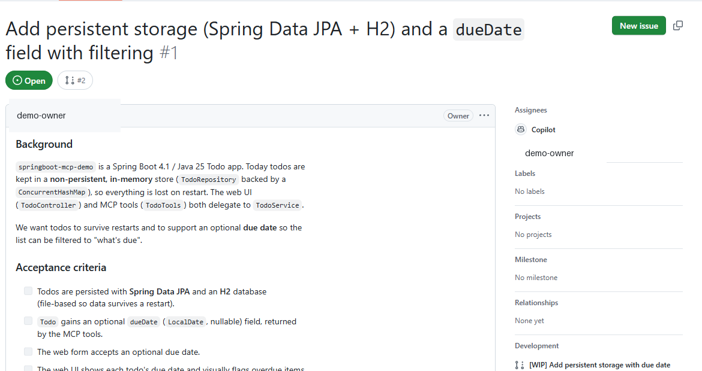
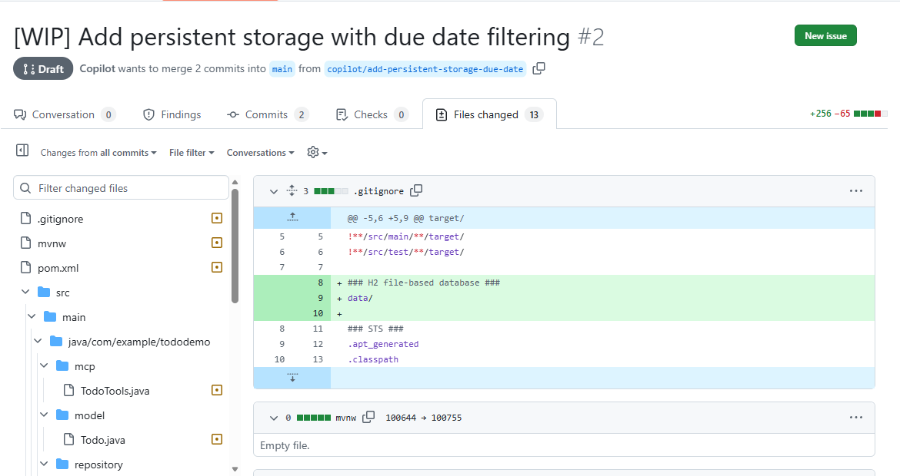

# Demo Recording Script — Java Spring Boot + Model Context Protocol (MCP) + Copilot

**Demo source:** Prepared local copy. Add the finished sample repository link only after publication approval.

> **Publication check:** Review every screenshot and screen recording for repository names, local paths, account names, notifications, and other identifying information. Redact or replace any exposed details before publishing.

## Episode 1 of 4 — Build and debug your first Spring Boot app

### Intro — Talking head (~50s)

> Welcome to this introduction to Java and Spring Boot in Visual Studio Code.
>
> Java is one of the world’s most widely used programming languages. Organizations of every size use it for enterprise applications, financial systems, cloud services, and Android apps. Its reliability, performance, and large ecosystem have made it a popular choice for decades.
>
> Spring Boot is one of the most popular Java frameworks. It handles much of the setup and configuration needed for modern applications, so developers can focus on application code instead of boilerplate.
>
> Whether you’re new to Java or already have some experience, the goal is to get you up and running with Java development in Visual Studio Code. In this video, I’ll install the Java and Spring tooling, use Spring Initializr to create the app’s starting project, then run the finished sample that you can clone. I’ll debug it and monitor its health and memory. Let’s jump right in.

**Do:** End on “let's jump right in,” then cut to screen share.

### Demo — Build & run

| Where | Do | Say |
|-------|----|-----|
| VS Code — Extensions view (`Ctrl+Shift+X`) | Search **"Extension Pack for Java"** and install. Then install a **Java Development Kit (JDK) 25** (Ctrl+Shift+P → *Java: Install New JDK*, or show it already installed). | "Let's start from nothing. First I install the Extension Pack for Java — that gives me language support, debugging, Maven, and testing in one bundle — plus a Java Development Kit, or JDK, to compile and run." |
| Extensions view | Search **"Spring Boot Extension Pack"** (Spring Boot Tools, Dashboard, Initializr) and install. | "Next, the Spring Boot Extension Pack. This adds the Spring Initializr, the Spring Boot Dashboard, and smart editing for Spring config." |
| Command Palette (`Ctrl+Shift+P`) | Run **"Spring Initializr: Create a Maven Project"**. Choose: Spring Boot 4.1.x → Java → group `com.example` → artifact `springboot-mcp-demo` → Java 25 → dependencies **Spring Web**, **Thymeleaf**, **Actuator**. | "Spring Initializr creates the starting project directly in Visual Studio Code. I choose Web, Thymeleaf, and Actuator to get started." |
| Explorer + editor | Close the temporary starting project and open the finished Todo sample. Show `TodoController`, `TodoService`, `TodoRepository`, `Todo`, and `templates/index.html`. | "To keep this focused, I'll switch to the finished Todo sample built from that starting project. The link is in the video description, so you can clone the sample and follow along." |
| Terminal | In a dedicated terminal, run `.\mvnw.cmd spring-boot:run`, open http://localhost:8080, then add, toggle, and delete a todo. When finished, stop the app with `Ctrl+C`. | "I run it with the Maven wrapper and exercise the basic flow: add, complete, delete. Then I stop this process before launching the debugger, so only one app is using port 8080." |

**The Spring Initializr version picker:**


**The running Todo web app:**


### Demo — Debug & watch memory

| Where | Do | Say |
|-------|----|-----|
| Editor — `TodoController.java` | Click the gutter to set a **breakpoint** on the `addForm` method (the `service.add(title)` line). | "Let's debug. I'll drop a breakpoint where a new todo gets created." |
| Spring Boot Dashboard / Run view | Start the app with **F5** (Debug). In the browser add a todo to hit the breakpoint. | "Launch in debug mode with F5, add a todo, and execution pauses right on our line." |
| Debug toolbar + Variables panel | Expand **Local** and inspect `title`, then step into `TodoService.add` (`F11`). Step over the `Todo todo = ...` line (`F10`) and inspect the new `todo` local. Continue (`F5`). Before recording, close Chat and hide any terminal output that contains local paths or account details. | "The controller shows me the incoming title. I can step into the service, execute the object creation, and inspect the new Todo before it is saved." |
| Spring Boot Dashboard → running app → **Memory** view (or Actuator) | Open the **Actuator / Memory** view; show heap/non-heap live gauges. Also hit http://localhost:8080/actuator/health. | "Because we added Actuator, VS Code gives me a live Memory view and health endpoint — real-time insight into the Java Virtual Machine while the app runs." |
| Debug toolbar | Stop the debug session (`Shift+F5`) before ending the episode. | "I'll stop the debug session here so port 8080 is free for the next run." |

**Actuator health summary (all systems UP; local filesystem details removed):**


**Spring Boot Dashboard Memory view — live heap gauge:**


### Outro — Talking head (~20s)

> And there it is. I installed the Java and Spring extensions, used Spring Initializr to create the starting project, cloned and ran the finished sample, then used Visual Studio Code to debug it and monitor its health and memory. That takes me from a new Java setup to understanding what a Spring Boot app is doing while it runs. What would you build first with Java and Spring Boot? Let me know in the comments. Thanks for watching, and happy building.

---

## Episode 2 of 4 — Expose your endpoints to Copilot with the Model Context Protocol (MCP)

### Intro — Talking head (~20s)

> In this video, I'll show how a Spring Boot app becomes a set of tools GitHub Copilot can call directly in Visual Studio Code. I'll use Spring AI to expose the existing Java operations through the Model Context Protocol, or MCP, while keeping the web interface and Copilot connected to the same service. Let's jump right in.

**Do:** End on “let's jump right in,” then cut to screen share.

**Prerequisites:** Open the prepared app, sign in to GitHub Copilot Chat, and allow MCP tool use when VS Code prompts for trust or confirmation.

### Demo

| Where | Do | Say |
|-------|----|-----|
| `pom.xml` | Show the dependency **`spring-ai-starter-mcp-server-webmvc`** and the `spring-ai-bom` 2.0.0. | "The MCP layer starts with the Spring AI MCP server dependency, with its version managed by the Spring AI Bill of Materials." |
| `mcp/TodoTools.java` | Walk through the `@McpTool` / `@McpToolParam` annotations on `addTodo`, `listTodos`, etc. Point out they just delegate to `TodoService`. | "Each method gets an `@McpTool` annotation with a name and description. They reuse the exact same service the web interface uses — no duplicated logic. Five tools: list, get, add, complete, delete." |
| `application.properties` | Highlight `spring.ai.mcp.server.protocol=STREAMABLE`. | "One critical setting: `protocol=STREAMABLE`. The Spring web starter defaults to the older Server-Sent Events transport — without this, `/mcp` returns 404." |
| Terminal | In a dedicated terminal, run `.\mvnw.cmd spring-boot:run` and wait for **`Registered tools: 5`**. Leave this terminal running. | "The startup log confirms that all five tools are registered and the app is serving the MCP endpoint." |
| `.vscode/mcp.json` | Show the `todo-mcp` entry for the running web endpoint. After the app is running, click its **Start** code-lens and approve the connection if prompted. | "This entry points VS Code at the running `/mcp` endpoint. Starting it here connects Copilot to the server; it does not launch the Java app itself." |
| Copilot Chat (Agent mode) | Enable the `todo-mcp` tools. Ask: *"Use the todo-mcp tools to add a todo called 'Email the stakeholders', then list all todos."* Refresh http://localhost:8080 and verify that exact title appears. | "Now I ask Copilot to add a todo and list the results. The tool call reaches the same Java service as the web interface, so the exact item created in chat appears in the browser." |
| Terminal | Stop the Spring Boot app with `Ctrl+C` after capturing the result. | "I'll stop the app here. Because the store is in memory, stopping it also clears the data." |

**Proof it works — a todo created *through MCP* appears in the web interface** (last row):


**Copilot Chat calling the `todo-mcp` tools — the `add_todo` call and its structured result:**


### Outro — Talking head (~20s)

> And there it is. I used Spring AI to expose the Todo operations as tools through the Model Context Protocol, connected those tools to GitHub Copilot in Visual Studio Code, and kept the web interface and Copilot using the same Java service. A Todo created through Copilot now appears in the web app straight away. What part of your own Java application would you turn into a Copilot tool? Let me know in the comments. Thanks for watching, and happy building.

---

## Episode 3 of 4 — Let Copilot test it with Playwright

### Intro — Talking head (~20s)

> In this video, I'll show how to test a Spring Boot web app in Visual Studio Code with GitHub Copilot and Playwright through the Model Context Protocol, or MCP. Passing unit tests don't prove the user interface works for a real user, so I'll have Copilot drive the app in a real browser and verify the experience end to end. Let's jump right in.

**Do:** End on “let's jump right in,” then cut to screen share.

**Prerequisites:** Install Node.js 18 or newer, use an installed Edge browser, sign in to GitHub Copilot Chat, and approve the Playwright MCP server and its tools when prompted.

### Demo

| Where | Do | Say |
|-------|----|-----|
| `.vscode/mcp.json` | Show the `playwright` server entry, which runs `@playwright/mcp` through `npx` with Microsoft Edge. Click its **Start** code-lens. | "The workspace includes the Playwright MCP server configuration. It uses the installed Edge browser, so I don't need a separate browser download." |
| Terminal 1 | Run `.\mvnw.cmd spring-boot:run` and leave the app running on http://localhost:8080. | "I start the app in its own terminal and leave it running while the browser and protocol checks execute." |
| `templates/index.html` | Point out the `data-testid` hooks: `new-todo-input`, `add-todo`, `todo-item`, `delete-todo`. | "I added stable test identifiers to the page so automation has reliable selectors." |
| Copilot Chat (Agent mode, Playwright MCP) | Ask: *"Use the Playwright tools to open http://localhost:8080. Add a todo called 'Verify the browser flow', find that todo's row, complete it and verify it is checked, then delete it and verify it is gone."* | "Using the Playwright tools, Copilot drives a real browser through one deterministic user journey and verifies the result at each stage." |
| Browser window (Playwright) | Watch the automated browser perform the add → complete → delete flow. | "There it goes: filling the input, clicking add, toggling, deleting — a full browser smoke test." |
| Terminal 2 | While the app remains running in Terminal 1, run `powershell -ExecutionPolicy Bypass -File scripts\mcp-smoke-test.ps1`, then `.\mvnw.cmd test`. | "The smoke test verifies the MCP handshake, the exact tool set, and a real `add_todo` result. The Maven tests separately cover the service, web flow, and Spring context." |
| Terminals / `.vscode/mcp.json` | Stop the app with `Ctrl+C`, then stop the Playwright MCP server. | "I stop both processes here, leaving the workspace ready for another clean run." |

**Representative smoke-test output** (session and generated todo identifiers vary):

```text
1. initialize  -> server: todo-mcp-server v1.0.0  (session dd013c8a-bee0-4393-be7e-8e2fc99aac00)
2. notifications/initialized -> sent
3. tools/list  -> 5 tools: add_todo, complete_todo, delete_todo, get_todo, list_todos
4. tools/call add_todo -> {"id":1,"title":"Created through the MCP add_todo tool","completed":false,"createdAt":"2026-07-16T10:54:28.414002200Z"}

MCP smoke test PASSED.
```

**Illustrative browser state during a Playwright run; the live Copilot tool calls are shown during the demo:**


### Outro — Talking head (~20s)

> And there it is. I connected Playwright to GitHub Copilot through the Model Context Protocol and had Copilot test the Spring Boot app in a real browser. It added a Todo, completed it, deleted it, and verified each result. Combined with the unit and integration tests, that gives me confidence in both the code and the experience a user actually sees. What browser workflow would you ask Copilot to test in your own app? Let me know in the comments. Thanks for watching, and happy building.

---

## Episode 4 of 4 — Hand a feature to the Copilot cloud agent

### Intro — Talking head (~20s)

> In this video, I'll hand the GitHub Copilot coding agent a complete feature for a Spring Boot Todo app and review the pull request it creates in Visual Studio Code. The issue asks the agent to save todos in a database so they survive restarts and to add an optional due date. It also asks for updates to the tools exposed through the Model Context Protocol, or MCP, plus tests for the new behavior. Let's jump right in.

**Do:** End on “let's jump right in,” then cut to screen share.

**Prerequisites:** Use a GitHub account with Copilot coding agent enabled, write access to the demo repository, and the GitHub Pull Requests extension signed in to VS Code.

**Recording plan:** Assign the issue before recording and let the asynchronous agent finish. During the video, use the prepared issue and draft pull request—do not create a duplicate or wait live. Keep the pull request unmerged until Episodes 1–3 are recorded so their baseline remains reproducible.

### Demo

| Where | Do | Say |
|-------|----|-----|
| `docs/copilot-agent-issue.md` | Open it; show the ready-to-assign task: add **Spring Data JPA** persistence with an **H2 database** and a **`dueDate`** field with filtering. | "Todos are in memory on purpose. This issue asks for an H2 database using Spring Data JPA. JPA stands for Java Persistence API, the standard interface used to map Java objects to database records. The issue also adds a due-date feature." |
| GitHub — prepared issue | Open the issue that was assigned to **@copilot** before recording. | "I assigned this scoped issue ahead of time because the coding agent works asynchronously in the cloud. That removes an unpredictable live wait from the demo." |
| GitHub Pull Requests view (VS Code) | Open the draft pull request after the implementation commit has arrived; update it with the current baseline, then review the 13-file feature diff, including the JPA entity, repository, `dueDate`, MCP changes, and tests. | "The agent opened a draft pull request and then completed the implementation. I first bring in the current baseline, then review the actual feature diff rather than assuming the first draft contains finished code." |
| Pull-request branch + Terminals | Check out the updated pull-request branch. Run `.\mvnw.cmd test`; start the app in one terminal; in another run `powershell -ExecutionPolicy Bypass -File scripts\mcp-smoke-test.ps1 -ExpectedTools add_todo,complete_todo,delete_todo,get_todo,list_todos,set_due_date`. Then create a todo with a due date, restart the app, and confirm it persists. | "Before I consider merging, I run the tests, verify the expanded six-tool MCP contract, and check the two key behaviors locally: due dates work and data survives a restart." |
| Pull request review | Review the results and leave comments if needed. Keep the pull request draft and unmerged during this recording; only mark it ready and merge after the review is complete and the baseline has been preserved. | "The agent produced the implementation, but the review, verification, and final merge decision still belong to me." |

**The prepared issue assigned to the Copilot coding agent (@copilot):**



**The draft pull request the Copilot agent opened — its 13-file diff includes the JPA entity, repository, `dueDate`, and tests:**



### Outro — Talking head (~30s)

> And that’s the feature done. The coding agent handled the implementation, created the tests, and opened the pull request, but I still reviewed the changes and decided what gets merged. That’s really the point: I can delegate the work without giving up control. Now I’m curious where you’d take it. What are you planning to build, and what questions do you still have? Tell me in the comments. Thanks for watching, and happy building.

**Do:** Hold on the reviewed draft pull request, then fade out.

---

## Resources (video descriptions / hand-off)

- **Demo source:** Add a repository link only after publication approval
- **Extension Pack for Java** (Microsoft): https://marketplace.visualstudio.com/items?itemName=vscjava.vscode-java-pack
- **Spring Boot Extension Pack:** search “Spring Boot Extension Pack” in the VS Code Marketplace
- **Java in VS Code:** https://code.visualstudio.com/docs/languages/java
- **Spring Boot Actuator:** https://docs.spring.io/spring-boot/
- **Spring AI (Model Context Protocol server):** https://docs.spring.io/spring-ai/reference/
- **Model Context Protocol:** https://modelcontextprotocol.io
- **Model Context Protocol in Visual Studio Code:** https://code.visualstudio.com/docs/copilot/chat/mcp-servers
- **Playwright Model Context Protocol server:** https://github.com/microsoft/playwright-mcp
- **GitHub Copilot coding agent:** https://docs.github.com/en/copilot
