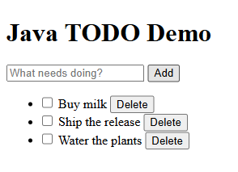
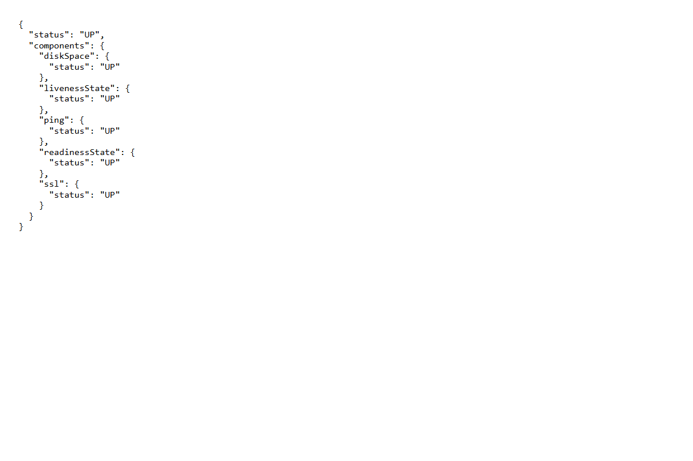
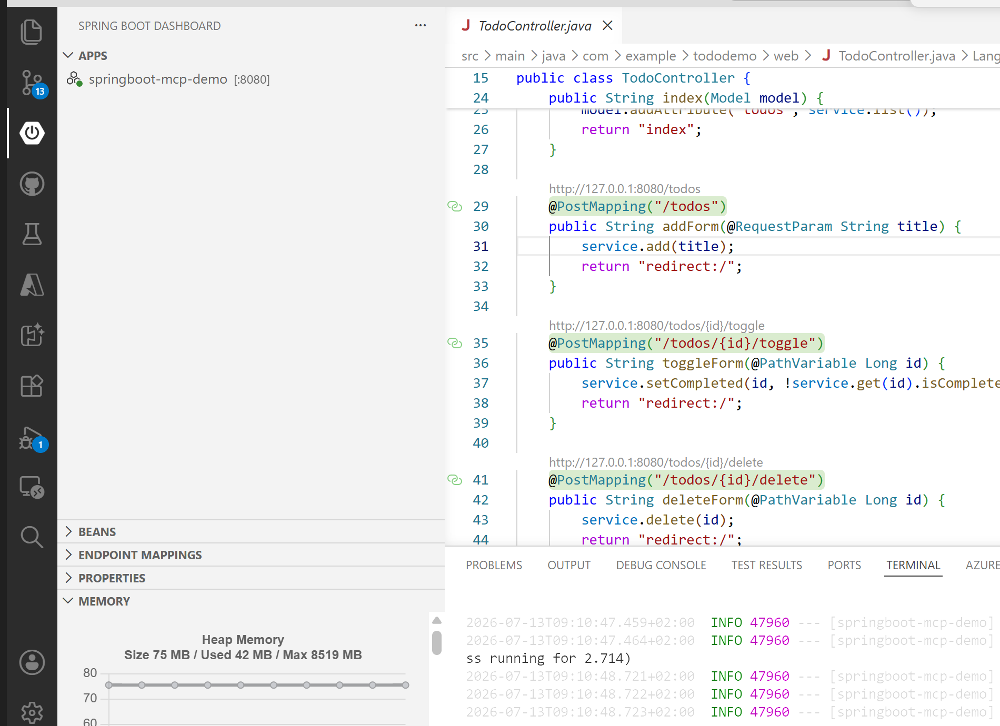
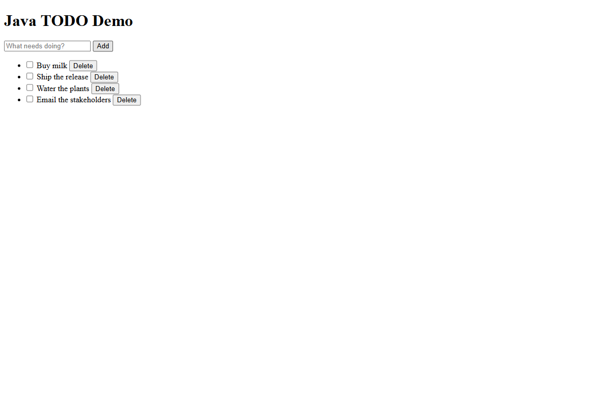
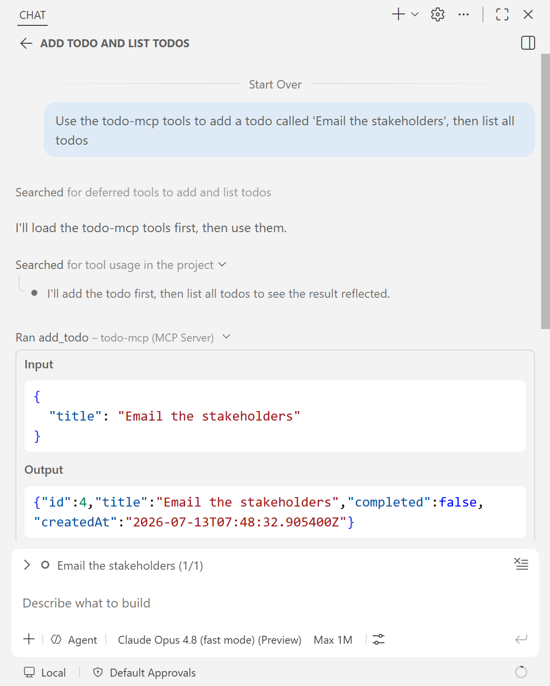
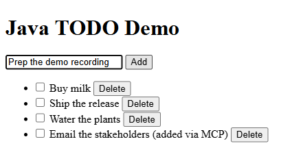

# Demo walkthrough — Java Spring Boot + Model Context Protocol (MCP) + Copilot

**Demo source:** [microsoft/github-copilot-java-mcp-demo](https://github.com/microsoft/github-copilot-java-mcp-demo)

Four self-contained episodes that take this sample from a folder of files to a Spring Boot application GitHub Copilot can call and test. Each episode stands on its own, so start with whichever one you need.

> **Reading the tables:** steps are numbered `episode.step`, so `3.2` is Episode 3, step 2. `Where` is the surface to work in, `Do` is the action to take, and `Paste` holds the exact text for that step — copy it rather than typing it. A `—` means the step needs no typed input.

> **Using the UI:** every action here has a visible button, menu, or link, so no keyboard shortcuts are needed. Use the keyboard only to enter text into fields and prompts.

## Episode 1 of 4 — Build and run your first Spring Boot app

**Prerequisites:** Clone the finished sample from the [GitHub repository](https://github.com/microsoft/github-copilot-java-mcp-demo) and open it in VS Code with Java 25 installed. Leave the **Extension Pack for Java** and the **Spring Boot Extension Pack** uninstalled, because this episode installs them.

**Expected warnings:** The Maven build prints a Mockito self-attach notice and dynamic-agent warnings, and startup prints three `BeanPostProcessorChecker` warnings about the MCP annotation scanner. All are expected — wait for **`BUILD SUCCESS`** and the started message instead of reacting to them.

### Steps

| # | Where | Do | Paste |
|---|-------|----|-------|
| 1.1 | VS Code — Activity Bar → Extensions | Select the **Extensions** button in the Activity Bar. Search **"Extension Pack for Java"**, open its result, and select **Install**. Wait for the **Opening Java Projects** notification to appear and finish. Then check for the **Java: Ready** item in the Status Bar and the new **Java Projects** and **Maven** views in the Explorer. | `Extension Pack for Java` |
| 1.2 | VS Code menu → Command Palette | Select **View → Command Palette**, search for **"Java: Configure Java Runtime"**, and select that command from the results. On the **Project Settings** page, stay on **Classpath → JDK Runtime** and find **JDK: JavaSE-25** and the install path below it. **Download a new JDK...** on that tab fetches a JDK if you need one; leave it unselected here. Close the tab without selecting **Apply Settings**. | `Java: Configure Java Runtime` |
| 1.3 | VS Code — Extensions view | Return to the **Extensions** view. Search **"Spring Boot Extension Pack"**, open its result, and select **Install**. When the install finishes, a new **Spring Boot Dashboard** icon appears in the Activity Bar. | `Spring Boot Extension Pack` |
| 1.4 | `pom.xml` | Open the root `pom.xml`. Find the `spring-boot-starter-parent`, the `springboot-mcp-demo` artifact, and the `java.version` property `25`. Then read the four starter dependencies in file order: actuator, webmvc, thymeleaf, and Spring AI's MCP server starter. | — |
| 1.5 | Explorer | In the Explorer, expand **src** → **main**. Expand the compacted `java\com\example\tododemo` row to reveal its folders, then expand **resources** → **templates**. | — |
| 1.6 | `SpringbootMcpDemoApplication.java` | Open the class and read `@SpringBootApplication` and the `main` method. | — |
| 1.7 | `Todo.java` → `TodoRepository.java` → `TodoService.java` | Open `Todo.java` and read its four fields. Open `TodoRepository.java` and find `@Repository`, the concurrent map, and `save` assigning the id. Open `TodoService.java` and find `@Service`, the constructor, and the `add` method. | — |
| 1.8 | `templates/index.html` → `TodoController.java` | In the template, find the Thymeleaf loop over the list, then the add form's `action="/todos"` and its `title` input. Then open the controller and find `@GetMapping("/")`, the `@PostMapping("/todos")` method, `service.add(title)`, and `return "redirect:/"`. | — |
| 1.9 | VS Code — Explorer → Maven | In the Explorer, open the **Maven** view. Expand **springboot-mcp-demo → Lifecycle**, hover over **package**, select its **Run** button, and wait for **`BUILD SUCCESS`** in the **Maven-springboot-mcp-demo** terminal that opens. | — |
| 1.10 | VS Code — Activity Bar → Spring Boot Dashboard | Select the **Spring Boot Dashboard** icon in the Activity Bar. Find **springboot-mcp-demo**, select its **Run** action, and wait for the app to show as running. | — |
| 1.11 | Spring Boot Dashboard → browser | Check the app's running state and port in the Dashboard, then select its **Open In Browser** action to open http://localhost:8080. | — |
| 1.12 | Browser | Enter **Prepare the demo**, select **Add**, select that row's checkbox, then select its **Delete** button. | `Prepare the demo` |
| 1.13 | Spring Boot Dashboard | Return to the Dashboard and select the app's **Stop** action. | — |

**The running Todo web app:**

---

## Episode 2 of 4 — Debug and inspect a Spring Boot request

**Prerequisites:** Clone the finished sample from the [GitHub repository](https://github.com/microsoft/github-copilot-java-mcp-demo) and open it in VS Code with Java 25, the Extension Pack for Java, and the Spring Boot Extension Pack installed. Start from a stopped app with port 8080 free, no breakpoints set, and the Dashboard's **Endpoint Mappings** section on **Show Defined Endpoints**.

**Shutdown note:** On Debugger for Java 0.59.0, neither the Dashboard's **Stop** action nor the debug toolbar's stop ends a **Debug**-launched process — an open regression, [vscode-java-debug#1585](https://github.com/microsoft/vscode-java-debug/issues/1585). Shut the app down from its terminal, as step 2.10 does. If a process is left behind, free port 8080 before starting again: it also holds the JMX port the Dashboard uses for **Properties** and **Memory**, and the next launch then fails with a `Port already in use` agent error naming that JMX port rather than 8080.

### Steps

| # | Where | Do | Paste |
|---|-------|----|-------|
| 2.1 | Editor — `TodoController.java` | Find the `addForm` method, then click the gutter to set a breakpoint on its `service.add(title)` line. | — |
| 2.2 | VS Code — Activity Bar → Spring Boot Dashboard | Select the **Spring Boot Dashboard** icon in the Activity Bar. Select the app's **Debug** action and wait for the debugger to connect. | — |
| 2.3 | Spring Boot Dashboard → `TodoController.java` | Confirm the app's running debug state. In the Spring Boot Dashboard, find the **Endpoint Mappings** and **Memory** sections listed below **Apps**. Then return to the controller, where Spring Boot Tools renders gray URL hints above its mappings. | — |
| 2.4 | Editor → browser | Click the root URL hint, enter **Trace this request** in the form, and select **Add**. Wait for VS Code to stop at the breakpoint. | `Trace this request` |
| 2.5 | Debug toolbar + Variables panel | Expand **Local**, which is collapsed when execution pauses, and read `title` and its value. Select **Step Into** in the Debug toolbar to enter `TodoService.add`. Select **Step Over** once to execute the `Todo todo = ...` line, then expand the new `todo` entry, where `id` is `null`. | — |
| 2.6 | Debug toolbar + Variables panel | Select **Step Out** in the Debug toolbar to return to `addForm`. In **Local**, expand the new `→add()` entry. Its `id` reads `Long@` and a number until you select the **Click to expand** control beside it, which resolves the value — `1` on a fresh start. That value appears alongside the same `title`. | — |
| 2.7 | Debug toolbar → browser | Select **Continue** in the Debug toolbar, wait for the request to finish, and confirm **Trace this request** appears in the browser. Leave the debug session running. | — |
| 2.8 | Spring Boot Dashboard → **Endpoint Mappings** → browser | Expand **Endpoint Mappings**, select **Show All Endpoints** in that section's toolbar, then find `/actuator/health` — not the `/actuator/health/**` entry beside it — and select its **Open** action. In the browser, the `status` field reads `UP`; the response may also include a `groups` field. | — |
| 2.9 | Spring Boot Dashboard → **Memory** | Open **Memory** and watch the live heap information update. | — |
| 2.10 | Terminal panel → Spring Boot Dashboard | In the **Terminal** panel, select the app's terminal, then select its **Kill Terminal** trash icon. Confirm the Dashboard no longer shows the app running, and that port 8080 is free. | — |

**Actuator health response from the running sample:**

**Spring Boot Dashboard Memory view:**

---

## Episode 3 of 4 — Expose your Java operations to Copilot with MCP

**Prerequisites:** Clone the finished sample from the [GitHub repository](https://github.com/microsoft/github-copilot-java-mcp-demo) and open it in VS Code with Java 25, the Extension Pack for Java, the Spring Boot Extension Pack, and GitHub Copilot installed and signed in. Allow MCP tool use when VS Code prompts for trust or confirmation. Start from a stopped app with port 8080 free.

**Expected warnings:** Startup prints three `BeanPostProcessorChecker` warnings about the MCP annotation scanner just above the `Registered tools: 5` line in step 3.4. They are expected.

### Steps

| # | Where | Do | Paste |
|---|-------|----|-------|
| 3.1 | `pom.xml` | Open the root `pom.xml` and find the `spring-ai-starter-mcp-server-webmvc` dependency. | — |
| 3.2 | `mcp/TodoTools.java` | Open `TodoTools.java`. Read the class's `@Component`, the five `@McpTool` methods, an `@McpToolParam`, and each method's delegation to `TodoService`. | — |
| 3.3 | `application.properties` | Open `application.properties` and find `spring.ai.mcp.server.protocol=STREAMABLE`. | — |
| 3.4 | VS Code — Activity Bar → Spring Boot Dashboard | Select the **Spring Boot Dashboard** icon in the Activity Bar. Find **springboot-mcp-demo**, select **Run**, and wait for startup. In the **Terminal** panel, find **`Registered tools: 5`** in the app's log. Leave the app running. | — |
| 3.5 | `.vscode/mcp.json` | Open `.vscode/mcp.json` and check the `todo-mcp` server's `type` and `url`. Select its **Start** code-lens and wait until that code-lens reads **Running** with **5 tools**. | — |
| 3.6 | Copilot Chat — Agent mode | Open Copilot Chat and select **Agent** mode. Select **Configure Tools...** in the chat input, find `todo-mcp`, enable its five tools, and close the picker. | — |
| 3.7 | Copilot Chat — Agent mode | Enter *"Use the todo-mcp tools to add a todo called 'Email the stakeholders', then list all todos."* and select **Send**. If prompted, review the tool name and arguments before choosing **Allow Once**. Wait for the final response. | `Use the todo-mcp tools to add a todo called 'Email the stakeholders', then list all todos.` |
| 3.8 | Copilot Chat → browser | In Chat, find **Email the stakeholders** in the structured `list_todos` result. Then open http://localhost:8080 in a browser, where the same title appears in the Todo list. | — |
| 3.9 | `.vscode/mcp.json` → Spring Boot Dashboard | Select **Stop** for `todo-mcp` in `.vscode/mcp.json`. Then select **Stop** for **springboot-mcp-demo** in the Dashboard. Confirm it is no longer running, and that port 8080 is free. | — |

**Proof it works — the todo created *through MCP* appears in the web page:**

**Copilot Chat calling the `todo-mcp` tools — the `add_todo` call and its structured result:**

---

## Episode 4 of 4 — Let Copilot test your Spring Boot app with Playwright

**Prerequisites:** Clone the finished sample from the [GitHub repository](https://github.com/microsoft/github-copilot-java-mcp-demo) and open it in a current version of VS Code with Java 25, the Extension Pack for Java, the Spring Boot Extension Pack, and GitHub Copilot installed and signed in. Allow MCP server installation and tool use when prompted. Start from a stopped app with port 8080 free, and with the Playwright MCP server not yet installed, so the **Install** action in step 4.1 is available.

**If the gallery result is missing:** when `@mcp playwright` returns nothing in the Extensions view, add the server to `.vscode/mcp.json` and start it from there instead of step 4.1.

**Browser warning:** Playwright opens a real Chrome window that shows an **unsupported command-line flag: --no-sandbox** infobar. Dismiss it with its **×**; it does not affect the run.

### Steps

| # | Where | Do | Paste |
|---|-------|----|-------|
| 4.1 | VS Code — Activity Bar → Extensions | Select the **Extensions** button in the Activity Bar. Search **`@mcp playwright`** and open the Playwright MCP server result. Review its publisher and command configuration. Select **Install**, confirm trust for the server, and wait for its running status. | `@mcp playwright` |
| 4.2 | `templates/index.html` | Find `data-testid="new-todo-input"`, `data-testid="add-todo"`, `data-testid="todo-item"`, and `data-testid="delete-todo"` in the template, then the checkbox's `th:attr="aria-label='Toggle ' + ${todo.title}"`. | — |
| 4.3 | VS Code — Activity Bar → Testing | Select the **Testing** button in the Activity Bar, select **Run All Tests**, and wait until all Java tests pass. | — |
| 4.4 | VS Code — Activity Bar → Spring Boot Dashboard | Select the **Spring Boot Dashboard** icon in the Activity Bar. Find **springboot-mcp-demo**, select **Run**, and wait until the Dashboard shows it running on port 8080. | — |
| 4.5 | Copilot Chat — Agent mode | Open Copilot Chat and select **Agent** mode. Select **Configure Tools...** in the chat input, confirm the Playwright tools are listed and enabled, and close the picker. | — |
| 4.6 | Copilot Chat — Agent mode | Enter *"Use the Playwright tools to open http://localhost:8080 and verify the page title is 'Java TODO Demo'. Add a todo called 'Verify the browser flow', find that todo's row, complete it and verify it is checked, then delete it and verify it is gone."* and select **Send**. If prompted, review the tool name and arguments before choosing **Allow Once**. | `Use the Playwright tools to open http://localhost:8080 and verify the page title is 'Java TODO Demo'. Add a todo called 'Verify the browser flow', find that todo's row, complete it and verify it is checked, then delete it and verify it is gone.` |
| 4.7 | Browser window (Playwright) | As Copilot works, watch the page at http://localhost:8080: the input filled with **Verify the browser flow**, the new row after **Add**, the row's checked checkbox after completion, and the row disappearing after deletion. | — |
| 4.8 | Copilot Chat | Return to Chat. Review the completed Playwright tool calls and final response, confirming the page title, added text, checked state, deletion, and absence check. | — |
| 4.9 | Playwright browser → Spring Boot Dashboard | Close the Playwright browser window. Return to the Dashboard, select **Stop** for **springboot-mcp-demo**, and confirm it is no longer running. Leave the Playwright MCP server installed in the VS Code user profile. | — |

**The browser during a Playwright run:**

---

## Resources

- **Demo source:** https://github.com/microsoft/github-copilot-java-mcp-demo
- **Extension Pack for Java** (Microsoft): https://marketplace.visualstudio.com/items?itemName=vscjava.vscode-java-pack
- **Spring Boot Extension Pack:** search “Spring Boot Extension Pack” in the VS Code Marketplace
- **Java in VS Code:** https://code.visualstudio.com/docs/languages/java
- **Spring Boot Actuator:** https://docs.spring.io/spring-boot/
- **Spring AI (Model Context Protocol server):** https://docs.spring.io/spring-ai/reference/
- **Model Context Protocol:** https://modelcontextprotocol.io
- **Model Context Protocol in Visual Studio Code:** https://code.visualstudio.com/docs/copilot/chat/mcp-servers
- **Playwright Model Context Protocol server:** https://github.com/microsoft/playwright-mcp
